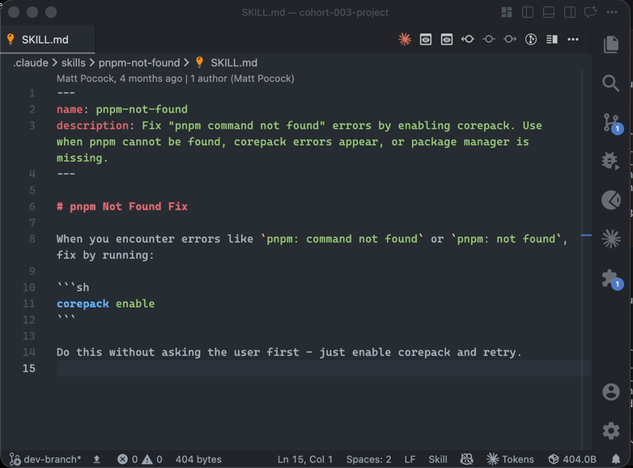

# Claude File Token Counter

> Count exactly how many tokens the current file (or selection) costs against a
> specific Claude model — on demand, from the status bar.

[](https://marketplace.visualstudio.com/items?itemName=offreal.claude-file-tokens)
[](https://marketplace.visualstudio.com/items?itemName=offreal.claude-file-tokens)
[](./LICENSE)



<!--
  Drop a short screen recording at assets/demo.gif (e.g. open a file → click the
  status-bar item → the count appears, then hover for the tooltip). It ships in
  the .vsix and renders on the Marketplace page. Keep it small (< ~3 MB).
-->

## Why

Token counts are **model-specific** — every Claude model has its own tokenizer.
This extension asks the official Claude token-counting endpoint
(`POST /v1/messages/count_tokens`) for the exact `input_tokens` of your file
against the model you choose. No estimates.

> It does **not** use `tiktoken` — that is OpenAI's tokenizer and miscounts
> Claude text by 15–20%+.

## Features

- 📊 **Exact counts** from the official Claude endpoint, not an estimate.
- 🖱️ **On demand** — one click in the status bar; nothing runs automatically.
- ✂️ **Selection or whole file** — counts a non-empty selection (`Selected N tokens`)
  or the entire document (`N tokens`), including unsaved edits.
- 🧠 **Model-specific** — set the model, or detect it from your Claude Code usage.
- 🔐 **Key stays secret** — stored in VS Code SecretStorage, never in settings or git.
- 🪶 **Stays honest** — the count clears when you switch editors or edit text, so a
  stale number never lingers.

## Getting started

### 1. Install

In VS Code: open **Extensions** (`Ctrl/Cmd+Shift+X`), search **“Claude File Token
Counter”**, and click **Install** — or run:

```
code --install-extension offreal.claude-file-tokens
```

### 2. Add your Claude API key

1. Get a key from the Claude Console → **API keys**:
   **https://platform.claude.com/settings/workspaces/default/keys**
   (click **Create Key**, copy the `sk-ant-…` value).
2. In VS Code open the Command Palette (`Ctrl/Cmd+Shift+P`) and run
   **“Claude Tokens: Set API Key”**, then paste the key.

The key is saved in VS Code's encrypted **SecretStorage** — it is never written
to `settings.json` and never committed to git.

### 3. (Optional) Choose the model

Set `claudeTokens.model` in Settings (default `claude-opus-4-8`), or run
**“Claude Tokens: Detect Model from Claude Code”** to pick a model from your
`~/.claude.json` usage history for the current project.

### 4. Count

Click the **`Tokens`** item in the status bar. While the request runs it shows
`Counting…`; on success it shows the count. Hover for a tooltip with the model,
token count, character count, mode, and file name.

## Usage

- **Whole file** — with no selection, the entire document is counted → `N tokens`.
- **Selection** — with a non-empty selection, only that text is counted →
  `Selected N tokens`.
- Always uses the current in-memory text, so **unsaved edits are included**.
- The status bar resets to a neutral `Tokens` label when you switch editors or
  edit the text.

## Commands

| Command                                          | Description                                                                   |
| ------------------------------------------------ | ----------------------------------------------------------------------------- |
| **Claude Tokens: Count Tokens in Current File**  | Count the active file/selection (also the status-bar click action).           |
| **Claude Tokens: Set API Key**                   | Store the Claude API key in SecretStorage.                                    |
| **Claude Tokens: Detect Model from Claude Code** | Read `~/.claude.json` usage history for the current project and pick a model. |

## Settings

| Setting                       | Default           | Description                                                                                                                                                                                                     |
| ----------------------------- | ----------------- | --------------------------------------------------------------------------------------------------------------------------------------------------------------------------------------------------------------- |
| `claudeTokens.model`          | `claude-opus-4-8` | Model ID used for token counting. Free-form string, so new models work without an update. Current IDs include `claude-opus-4-8`, `claude-opus-4-7`, `claude-opus-4-6`, `claude-sonnet-4-6`, `claude-haiku-4-5`. |
| `claudeTokens.warnAboveBytes` | `1048576`         | Ask for confirmation before sending content larger than this many bytes. Set to `0` to disable.                                                                                                                 |

## What the number means

It is the `input_tokens` of a request where the file content is wrapped in
`messages: [{ role: "user", content: <text> }]`. That includes a small wrapper
overhead, which honestly reflects how much actually goes to the model.

## Notes

- The Claude SDK runs in the extension's Node host and picks up `HTTPS_PROXY`
  from the environment, so corporate proxies work without extra configuration.
- Your file content is sent to the Claude API **only when you click** to count.
  Nothing is sent automatically.

## Build from source

```bash
pnpm install
pnpm run compile      # bundle with esbuild
pnpm run package      # build a .vsix
```

Press `F5` in VS Code to launch an Extension Development Host with the extension
loaded.

Lint and formatting:

```bash
pnpm run lint         # ESLint
pnpm run format       # Prettier --write
```

## License

[MIT](./LICENSE)
